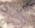
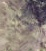
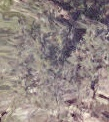
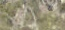
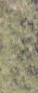
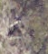
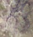
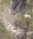
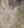
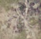

# 🌲 Neon Tree Crown Detection & Clustering

This project performs **tree crown detection and clustering** on RGB aerial imagery from the NEON dataset. It uses bounding box annotations to extract individual tree crowns, compute HSV color histograms, and cluster similar crowns using unsupervised learning.

> 🎯 The goal is to demonstrate preprocessing, feature extraction, and clustering in a real-world computer vision pipeline.

---

## 📂 Dataset

- **Source**: [NeonTreeEvaluation GitHub Repo](https://github.com/weecology/NeonTreeEvaluation)
- Includes:
  - Aerial RGB images
  - XML annotations of tree crowns (Pascal VOC format)

---

## 📸 Sample Images and Cropped Crowns

Below are sample input images and their corresponding cropped crown regions, extracted using bounding boxes.

### 🔹 Image 1

**Original Image**  


**Cropped Crowns**  
  

---

### 🔹 Image 2

**Original Image**  


**Cropped Crown**  




---

### 🔹 Image 3

**Original Image**  


**Cropped Crown**  









---

## 🧠 Project Pipeline

### 1. 🗂️ Unzip and Load Data
- RGB and XML annotation files are unzipped and parsed.
- Each XML file is linked to its corresponding image.

### 2. 📦 Bounding Box Extraction
- The `parse_annotation()` function reads each XML and extracts `(xmin, ymin, xmax, ymax)` for all tree crowns.

### 3. ✂️ Cropping Crowns
- Each bounding box is used to crop a crown from the RGB image.
- Cropped images are saved to `/content/cropped_crowns`.

### 4. 🌈 Feature Extraction
- HSV color histograms are computed using `cv2.calcHist()`.
- Histograms are flattened and normalized.

### 5. 🤖 Clustering
- Crowns are grouped using `KMeans(n_clusters=2)`.
- Cluster distribution is printed.
- Sample images from each cluster are visualized.

---

## 📊 Output Preview

The cropped crowns are clustered into visually distinct groups.  
Each cluster can represent different vegetation types or lighting conditions.

```python
Cluster distribution: Counter({0: 123, 1: 98})
